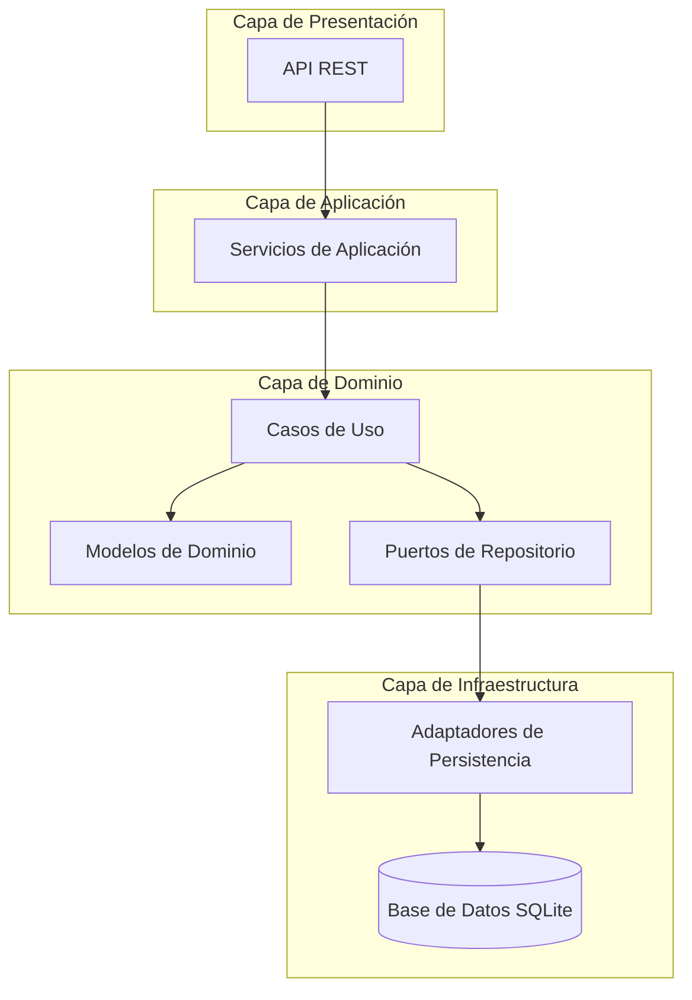
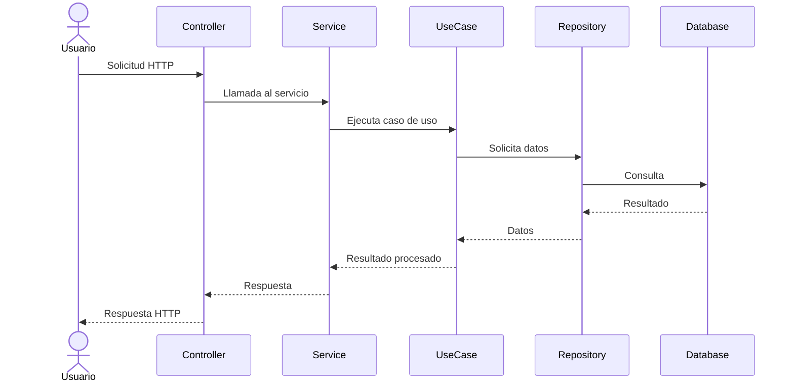
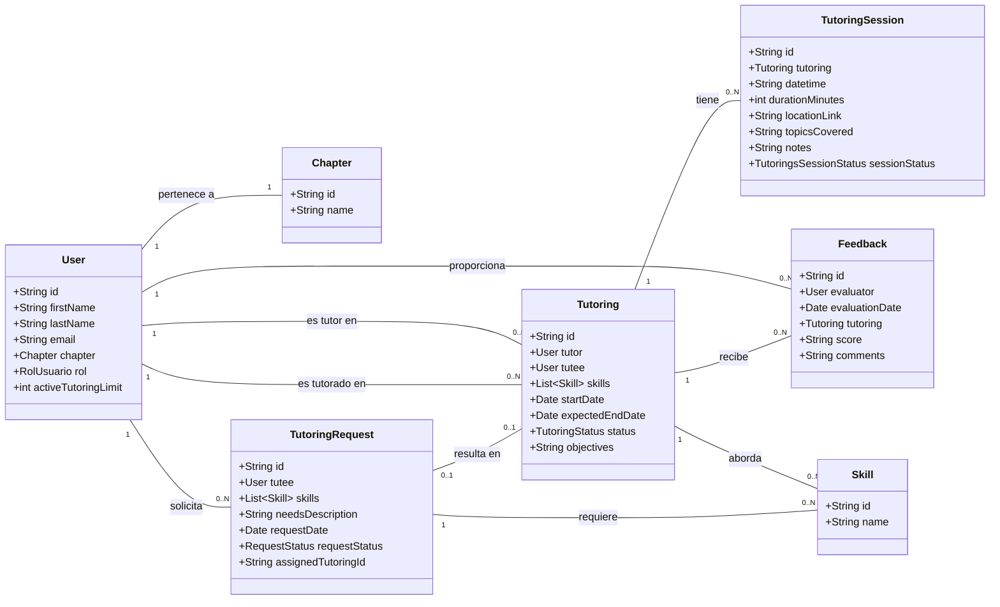

# Sistema de Tutorías

## Descripción General

El Sistema de Tutorías es una aplicación desarrollada con Spring Boot que facilita la gestión de tutorías entre tutores y tutorados dentro de una organización. La plataforma permite solicitar tutorías sobre habilidades específicas, gestionar el ciclo de vida completo de las tutorías, programar sesiones, y proporcionar retroalimentación.

El sistema está diseñado siguiendo los principios de la Arquitectura Hexagonal (Ports and Adapters), lo que permite una clara separación de responsabilidades y facilita la mantenibilidad y escalabilidad del código.

## Arquitectura del Sistema

### Arquitectura Hexagonal

El proyecto implementa la Arquitectura Hexagonal (también conocida como Ports and Adapters), que organiza el código en tres capas principales:

1. **Dominio**: Contiene las entidades de negocio, reglas y lógica de dominio.
2. **Aplicación**: Orquesta los casos de uso mediante servicios que coordinan las operaciones del dominio.
3. **Infraestructura**: Implementa los adaptadores para interactuar con el mundo exterior (API REST, base de datos, etc.).

### Estructura de Paquetes

La estructura del proyecto sigue un enfoque modular por funcionalidad:

```
com.pragma
├── chapter/                  # Módulo de capítulos/departamentos
├── feedbacks/                # Módulo de retroalimentación
├── shared/                   # Componentes compartidos
├── skills/                   # Módulo de habilidades
├── tutoring_sessions/        # Módulo de sesiones de tutoría
├── tutorings/                # Módulo de tutorías
├── tutorings_requests/       # Módulo de solicitudes de tutoría
└── usuarios/                 # Módulo de usuarios
```

Cada módulo sigue la estructura de la arquitectura hexagonal:

```
módulo/
├── application/
│   └── service/              # Servicios de aplicación
├── domain/
│   ├── model/                # Entidades de dominio
│   └── port/
│       ├── input/            # Puertos de entrada (casos de uso)
│       └── output/           # Puertos de salida (repositorios)
└── infrastructure/
    └── adapter/
        ├── input/
        │   └── rest/         # Controladores REST
        │       ├── dto/      # Objetos de transferencia de datos
        │       └── mapper/   # Mapeadores DTO <-> Entidad
        └── output/
            └── persistence/  # Implementación de repositorios
                ├── entity/   # Entidades JPA
                ├── mapper/   # Mapeadores Entidad <-> Modelo
                └── repository/ # Repositorios Spring Data
```

## Diagrama de Componentes



## Diagrama de Flujo de Datos



## Diagrama de Entidades



## Módulos Principales

### 1. Usuarios (Users)

Gestiona la información de los usuarios del sistema, que pueden tener diferentes roles:
- **Tutor**: Puede impartir tutorías en sus áreas de experiencia.
- **Tutorado**: Puede solicitar tutorías en habilidades que desea desarrollar.
- **Administrador**: Gestiona el sistema.

### 2. Habilidades (Skills)

Representa las competencias o conocimientos que pueden ser objeto de tutoría.

### 3. Capítulos (Chapters)

Representa los departamentos o áreas de la organización a las que pertenecen los usuarios.

### 4. Solicitudes de Tutoría (Tutoring Requests)

Gestiona las peticiones de tutoría realizadas por los tutorados, con estados:
- **Enviada**: Estado inicial de una solicitud.
- **Aprobada**: La solicitud ha sido aprobada pero aún no asignada a un tutor.
- **Asignada**: Se ha asignado un tutor y se ha creado una tutoría.
- **Rechazada**: La solicitud ha sido rechazada.

### 5. Tutorías (Tutorings)

Representa las tutorías activas entre un tutor y un tutorado, con estados:
- **Activa**: La tutoría está en curso.
- **Completada**: La tutoría ha finalizado satisfactoriamente.
- **Cancelada**: La tutoría ha sido cancelada.

### 6. Sesiones de Tutoría (Tutoring Sessions)

Gestiona las sesiones individuales dentro de una tutoría, con estados:
- **Programada**: La sesión está planificada.
- **Realizada**: La sesión se ha llevado a cabo.
- **Cancelada**: La sesión ha sido cancelada.

### 7. Retroalimentación (Feedbacks)

Permite a los usuarios proporcionar evaluaciones y comentarios sobre las tutorías.

### 8. Estadísticas (Statistics)

Proporciona métricas y estadísticas del sistema para dashboards administrativos, incluyendo:
- Solicitudes por estado
- Tutorías por estado
- Tutores activos por capítulo

## Flujos Principales

### Flujo de Solicitud y Asignación de Tutoría

1. Un tutorado crea una solicitud de tutoría especificando las habilidades requeridas.
2. La solicitud se marca como "Enviada".
3. Un administrador revisa la solicitud y la aprueba o rechaza.
4. Si es aprobada, se asigna a un tutor disponible.
5. Se crea una tutoría vinculada a la solicitud.
6. La solicitud se marca como "Asignada".

### Flujo de Gestión de Tutorías

1. Una vez creada, la tutoría tiene estado "Activa".
2. Se pueden programar múltiples sesiones de tutoría.
3. Al finalizar, el tutor o tutorado puede marcar la tutoría como "Completada".
4. En cualquier momento, la tutoría puede ser "Cancelada".
5. Los usuarios pueden proporcionar retroalimentación sobre la tutoría.

## Requisitos de Instalación

### Prerrequisitos

- Java 21
- Maven 3.9+
- SQLite (incluido como dependencia)

### Configuración

1. Clonar el repositorio:
   ```bash
   git clone https://github.com/tu-usuario/sistematutorias.git
   cd sistematutorias
   ```

2. Compilar el proyecto:
   ```bash
   mvn clean install
   ```

3. Ejecutar la aplicación:
   
   **Desarrollo local (SQLite):**
   ```bash
   mvn spring-boot:run -Dspring-boot.run.profiles=local
   ```
   
   **Desarrollo con MySQL:**
   ```bash
   mvn spring-boot:run -Dspring-boot.run.profiles=dev
   ```
   
   **Script de desarrollo:**
   ```bash
   ./run-dev.sh
   ```

### Configuración con Docker

También puedes ejecutar la aplicación usando Docker:

**Usando Docker Compose (Recomendado):**
```bash
# Levantar toda la infraestructura (MySQL + App)
docker-compose up -d

# Ver logs
docker-compose logs -f

# Detener servicios
docker-compose down
```

**Usando Docker directamente:**
```bash
# Construir la imagen
docker build -t sistematutorias .

# Ejecutar el contenedor
docker run -p 8080:8080 sistematutorias
```

**Configuración de Base de Datos:**
- **Local**: SQLite (archivo `mydatabase.db`)
- **Desarrollo**: MySQL 8.0 con Docker Compose
- **Variables de entorno**: Configurables para diferentes entornos

## API REST

La API REST está completamente documentada con OpenAPI 3.0. La documentación incluye:
- Especificaciones completas de endpoints
- Esquemas de datos
- Ejemplos de request/response
- Códigos de estado HTTP
- Autenticación con Google ID

**Acceso a la documentación:**
- **Swagger UI**: `http://localhost:8080/swagger-ui.html`
- **OpenAPI Spec**: Ver archivo `openapi-complete.yaml`

**Autenticación:**
La API utiliza autenticación basada en Google User ID enviado en el header `Authorization`.

### Endpoints Principales

- **Usuarios**: `/api/v1/users`
- **Habilidades**: `/api/v1/skills`
- **Capítulos**: `/api/chapter`
- **Solicitudes de Tutoría**: `/api/v1/tutoring-requests`
- **Tutorías**: `/api/v1/tutorings`
- **Sesiones de Tutoría**: `/api/v1/tutoring-sessions`
- **Retroalimentación**: `/api/v1/feedbacks`
- **Estadísticas**: `/api/v1/statistics`
- **Monitoreo**: `/actuator/health`

## Pruebas y Calidad de Código

El proyecto incluye pruebas unitarias completas y análisis de cobertura:

**Ejecutar pruebas:**
```bash
mvn test
```

**Generar reporte de cobertura:**
```bash
mvn clean test jacoco:report
```

**Ver reporte de cobertura:**
El reporte se genera en `target/site/jacoco/index.html`

**Cobertura actual:**
- Pruebas unitarias para todos los servicios
- Pruebas de controladores REST
- Pruebas de adaptadores de persistencia
- Pruebas de integración para autenticación
- Exclusión de mappers automáticos de la cobertura

## Tecnologías Utilizadas

- **Spring Boot 3.5.0**: Framework principal
- **Java 21**: Versión de Java
- **Spring Data JPA**: Persistencia de datos
- **SQLite**: Base de datos para desarrollo local
- **MySQL 8.0**: Base de datos para producción
- **Lombok**: Reducción de código boilerplate
- **MapStruct 1.5.5**: Mapeo entre objetos
- **Spring Boot Validation**: Validación de datos
- **Spring Boot Actuator**: Monitoreo y métricas
- **JUnit 5**: Pruebas unitarias
- **JaCoCo**: Cobertura de código
- **Docker**: Contenerización
- **OpenAPI 3.0**: Documentación de API

## Notas para Desarrolladores

### Arquitectura y Patrones
- El proyecto sigue los principios SOLID y Clean Architecture
- Implementa Arquitectura Hexagonal (Ports and Adapters)
- Utiliza el patrón Repository para acceso a datos
- Separación clara entre capas de dominio, aplicación e infraestructura

### Convenciones de Código
- DTOs para comunicación entre capas
- MapStruct para conversiones automáticas
- Lombok para reducir boilerplate
- Validación en múltiples niveles (API y dominio)
- Manejo centralizado de excepciones

### Configuración de Perfiles
- **local**: SQLite para desarrollo rápido
- **dev**: MySQL para entorno de desarrollo
- **test**: Configuración específica para pruebas

### Autenticación y Seguridad
- Interceptor personalizado para autenticación Google
- Context de usuario para operaciones autenticadas
- Configuración flexible de rutas protegidas

### Monitoreo
- Spring Boot Actuator habilitado
- Health checks disponibles en `/actuator/health`

## Contribución

Para contribuir al proyecto:

1. Crear una rama para tu funcionalidad: `git checkout -b feature/nueva-funcionalidad`
2. Realizar cambios y pruebas
3. Enviar un Pull Request

## Licencia

Este proyecto está licenciado bajo [Licencia Propietaria].