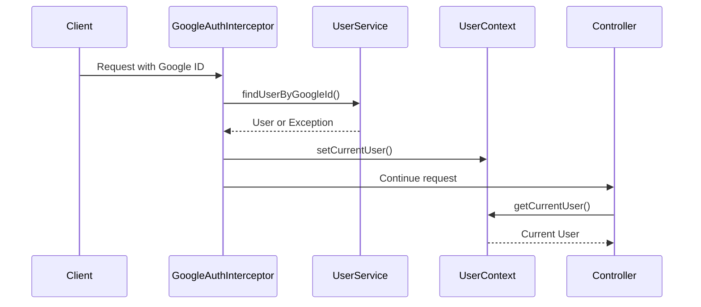
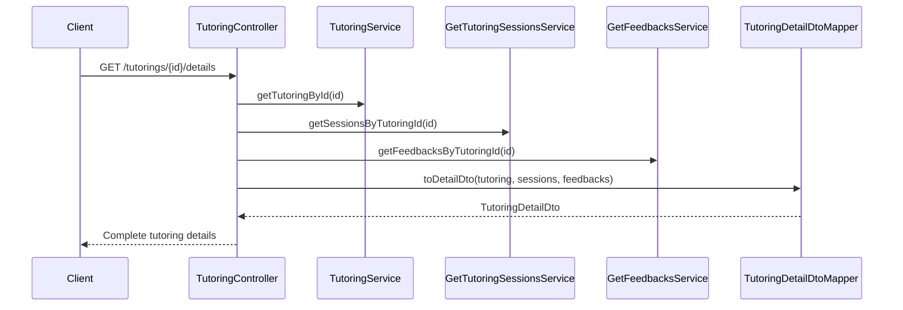
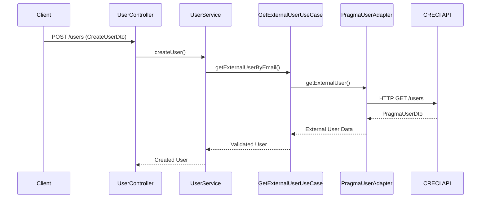

# Arquitectura del Sistema de Tutorías v2.0

## Resumen Ejecutivo

El Sistema de Tutorías v2.0 ha evolucionado significativamente desde su versión inicial, incorporando nuevas funcionalidades que mejoran la experiencia del usuario, la seguridad y la integración con sistemas externos. Esta versión mantiene la arquitectura hexagonal como base, pero añade nuevas capas y patrones para soportar las funcionalidades avanzadas.

## Arquitectura General

### Principios Arquitectónicos

1. **Arquitectura Hexagonal (Ports and Adapters)**
   - Separación clara entre lógica de negocio e infraestructura
   - Inversión de dependencias
   - Testabilidad mejorada

2. **Domain-Driven Design (DDD)**
   - Modelado basado en el dominio de negocio
   - Bounded contexts bien definidos
   - Lenguaje ubicuo

3. **Clean Architecture**
   - Independencia de frameworks
   - Independencia de UI
   - Independencia de base de datos
   - Testabilidad

### Estructura de Capas

```
┌─────────────────────────────────────────────────────────────┐
│                    Capa de Presentación                     │
│  ┌─────────────────┐  ┌─────────────────┐  ┌─────────────┐ │
│  │  REST API       │  │  Security       │  │  Profile    │ │
│  │  Controllers    │  │  Interceptors   │  │  Endpoints  │ │
│  └─────────────────┘  └─────────────────┘  └─────────────┘ │
└─────────────────────────────────────────────────────────────┘
                                │
┌─────────────────────────────────────────────────────────────┐
│                    Capa de Aplicación                       │
│  ┌─────────────────┐  ┌─────────────────┐  ┌─────────────┐ │
│  │  Use Cases      │  │  Services       │  │  Context    │ │
│  │  (Ports Input)  │  │  Application    │  │  Helpers    │ │
│  └─────────────────┘  └─────────────────┘  └─────────────┘ │
└─────────────────────────────────────────────────────────────┘
                                │
┌─────────────────────────────────────────────────────────────┐
│                      Capa de Dominio                        │
│  ┌─────────────────┐  ┌─────────────────┐  ┌─────────────┐ │
│  │  Entities       │  │  Value Objects  │  │  Domain     │ │
│  │  Aggregates     │  │  Enums          │  │  Services   │ │
│  └─────────────────┘  └─────────────────┘  └─────────────┘ │
└─────────────────────────────────────────────────────────────┘
                                │
┌─────────────────────────────────────────────────────────────┐
│                   Capa de Infraestructura                   │
│  ┌─────────────────┐  ┌─────────────────┐  ┌─────────────┐ │
│  │  Persistence    │  │  External APIs  │  │  Security   │ │
│  │  Adapters       │  │  Adapters       │  │  Context    │ │
│  └─────────────────┘  └─────────────────┘  └─────────────┘ │
└─────────────────────────────────────────────────────────────┘
```

## Módulos y Bounded Contexts

### 1. Módulo de Usuarios (Users)

**Responsabilidades:**
- Gestión del ciclo de vida de usuarios
- Integración con API externa (CRECI)
- Validación y autenticación
- Gestión de roles y permisos

**Nuevas Funcionalidades v2.0:**
- **Integración Externa**: Validación automática contra API CRECI
- **Filtros Avanzados**: Búsqueda con operadores OR
- **Gestión de Límites**: Configuración dinámica de límites de tutoría
- **Perfil de Usuario**: Endpoint dedicado para información personal

**Componentes Clave:**
```
usuarios/
├── application/service/
│   └── UserService.java
├── domain/
│   ├── model/User.java
│   └── port/
│       ├── input/
│       │   ├── GetExternalUserUseCase.java
│       │   ├── GetAllUsersWithTutoringCountUseCase.java
│       │   └── UpdateTutoringLimitUseCase.java
│       └── output/
│           ├── UserRepository.java
│           └── ExternalUserRepository.java
└── infrastructure/adapter/
    ├── input/rest/UserController.java
    └── output/
        ├── persistence/UserPersistenceAdapter.java
        └── external/PragmaUserAdapter.java
```

### 2. Módulo de Tutorías (Tutorings)

**Responsabilidades:**
- Gestión del ciclo de vida de tutorías
- Coordinación entre tutores y tutorados
- Estados avanzados de tutoría
- Vista detallada con información completa

**Nuevas Funcionalidades v2.0:**
- **Vista Detallada**: Endpoint `/details` con sesiones y feedbacks
- **Filtros por Participante**: Búsqueda por tutor/tutorado
- **Gestión de Cancelaciones**: Estados intermedios para cancelaciones
- **URL de Acta Final**: Campo para documento final

**Componentes Clave:**
```
tutorings/
├── application/service/
│   ├── TutoringService.java
│   └── GetTutoringsService.java
├── domain/
│   ├── model/
│   │   ├── Tutoring.java
│   │   └── enums/TutoringStatus.java (SOLICITUD_CANCELACION)
│   └── port/input/GetTutoringsUseCase.java
└── infrastructure/adapter/input/rest/
    ├── TutoringController.java
    ├── dto/TutoringDetailDto.java
    └── mapper/TutoringDetailDtoMapper.java
```

### 3. Módulo de Solicitudes (Tutoring Requests)

**Responsabilidades:**
- Gestión de solicitudes de tutoría
- Estados de negociación
- Eliminación automática de solicitudes huérfanas

**Nuevas Funcionalidades v2.0:**
- **Estado "Conversando"**: Para negociación de términos
- **Eliminación Inteligente**: Limpieza automática de solicitudes sin tutoría
- **Filtros Mejorados**: Búsqueda por múltiples criterios

### 4. Módulo de Retroalimentación (Feedbacks)

**Responsabilidades:**
- Gestión de evaluaciones
- Asignación automática de evaluadores
- Integración con vista detallada

**Nuevas Funcionalidades v2.0:**
- **Evaluador Automático**: Asignación desde contexto de usuario
- **Seguridad Mejorada**: Eliminación del evaluatorId del body
- **Integración**: Inclusión automática en vista detallada

### 5. Módulo de Sesiones (Tutoring Sessions)

**Responsabilidades:**
- Programación de sesiones individuales
- Seguimiento de progreso
- Integración con tutorías

**Nuevas Funcionalidades v2.0:**
- **Servicios de Consulta**: GetTutoringSessionsService
- **Integración**: Inclusión en vista detallada de tutorías

## Componentes Transversales

### 1. Sistema de Autenticación y Seguridad

**Componentes:**
```
shared/security/
├── GoogleAuthInterceptor.java
├── exception/
│   ├── AuthenticationException.java
│   ├── InvalidAuthorizationException.java
│   ├── MissingAuthorizationException.java
│   └── UserNotFoundException.java
└── config/AuthenticationProperties.java
```

**Funcionalidades:**
- Interceptor para validación de Google ID
- Manejo centralizado de excepciones de autenticación
- Configuración flexible de rutas protegidas

### 2. Contexto de Usuario

**Componentes:**
```
shared/context/
├── UserContext.java
├── UserContextHelper.java
└── config/
```

**Funcionalidades:**
- **UserContext**: ThreadLocal para usuario actual
- **UserContextHelper**: Utilidades para validación de permisos
  - `getCurrentUserOrThrow()`
  - `requireAdminRole()`
  - `requireResourceAccess(String resourceId)`
  - `canActAsTutor()`
  - `isCurrentUserAdmin()`

### 3. Integración Externa

**Componentes:**
```
shared/config/
├── ExternalApiProperties.java
├── RestTemplateConfig.java
└── usuarios/infrastructure/adapter/output/external/
    ├── PragmaUserAdapter.java
    └── dto/PragmaUserDto.java
```

**Funcionalidades:**
- Cliente HTTP configurado para APIs externas
- Adaptador para API CRECI
- Configuración centralizada de URLs externas
- Manejo de errores en integraciones

## Patrones de Diseño Implementados

### 1. Adapter Pattern
- **PragmaUserAdapter**: Adaptación de API externa a modelo interno
- **Persistence Adapters**: Adaptación entre JPA y modelo de dominio

### 2. Strategy Pattern
- **Validación de Usuarios**: Diferentes estrategias para usuarios internos/externos
- **Filtros de Búsqueda**: Estrategias de filtrado con operadores OR

### 3. Facade Pattern
- **TutoringDetailDto**: Fachada para información compleja de tutorías
- **UserContextHelper**: Fachada para operaciones de contexto de usuario

### 4. Factory Pattern
- **Mappers**: Creación de objetos DTO/Entity
- **Exception Factories**: Creación consistente de excepciones

### 5. Repository Pattern
- **Repositorios de Dominio**: Abstracción de persistencia
- **External Repositories**: Abstracción de APIs externas

## Flujos de Datos Principales

### 1. Flujo de Autenticación



### 2. Flujo de Vista Detallada de Tutoría



### 3. Flujo de Integración Externa



## Configuración y Propiedades

### Nuevas Propiedades v2.0

```properties
# Configuración de API externa
external.api.creci.base-url=https://api.creci.example.com
external.api.creci.users-endpoint=/api/v1/users

# Configuración de autenticación
app.auth.header-name=Authorization
app.auth.protected-paths=/api/**

# Configuración de RestTemplate
rest.template.connect-timeout=5000
rest.template.read-timeout=10000
```

### Perfiles de Aplicación

- **local**: SQLite + datos de prueba + mocks externos
- **dev**: MySQL + integración externa real
- **test**: H2 + mocks completos
- **prod**: MySQL + configuración de producción

## Métricas y Monitoreo

### Endpoints de Monitoreo

- `/actuator/health`: Health check básico
- `/api/profile/*`: Endpoints para debugging de contexto de usuario
- `/api/v1/statistics/dashboard`: Métricas de negocio

### Logging Estructurado

```java
// Ejemplo de logging con contexto
log.info("User {} creating tutoring for request: {} with tutor: {}", 
        currentUser.getEmail(), 
        createTutoringDto.getTutoringRequestId(), 
        createTutoringDto.getTutorId());
```

## Consideraciones de Seguridad

### 1. Autenticación
- Validación obligatoria de Google ID
- Context de usuario thread-safe
- Manejo seguro de excepciones de autenticación

### 2. Autorización
- Validación de permisos por rol
- Acceso a recursos basado en propiedad
- Operaciones administrativas protegidas

### 3. Integraciones Externas
- Timeouts configurados
- Manejo de errores robusto
- Validación de datos externos

## Escalabilidad y Performance

### 1. Consultas Optimizadas
- Filtros con índices apropiados
- Consultas JPQL optimizadas para filtros OR
- Lazy loading en relaciones complejas

### 2. Cache Considerations
- Candidatos para cache: usuarios externos, capítulos, habilidades
- Cache de sesión para contexto de usuario
- Invalidación inteligente de cache

### 3. Arquitectura Stateless
- Context de usuario por request
- Sin estado compartido entre requests
- Escalabilidad horizontal preparada

## Próximos Pasos Arquitectónicos

### 1. Microservicios
- Separación por bounded context
- API Gateway para enrutamiento
- Service discovery

### 2. Event-Driven Architecture
- Eventos de dominio para cambios de estado
- Message queues para procesamiento asíncrono
- Event sourcing para auditoría

### 3. CQRS (Command Query Responsibility Segregation)
- Separación de comandos y consultas
- Modelos de lectura optimizados
- Eventual consistency

### 4. Observabilidad
- Distributed tracing
- Métricas de negocio en tiempo real
- Alertas proactivas

## Conclusión

La arquitectura v2.0 del Sistema de Tutorías mantiene los principios sólidos de la versión inicial mientras incorpora nuevas capacidades que mejoran significativamente la funcionalidad y la experiencia del usuario. La arquitectura hexagonal sigue siendo el núcleo, pero se ha enriquecido con patrones adicionales y componentes transversales que soportan las nuevas funcionalidades de manera elegante y mantenible.

Las mejoras en autenticación, integración externa, y funcionalidades de negocio posicionan al sistema para futuras evoluciones hacia microservicios y arquitecturas más distribuidas, manteniendo siempre la calidad del código y la separación de responsabilidades.